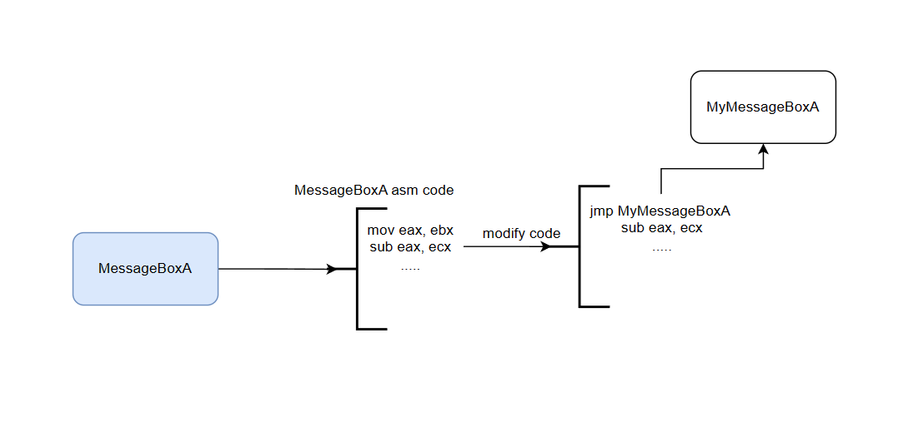
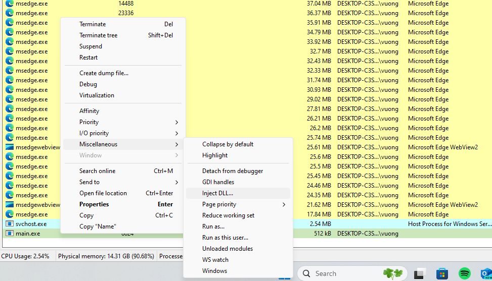
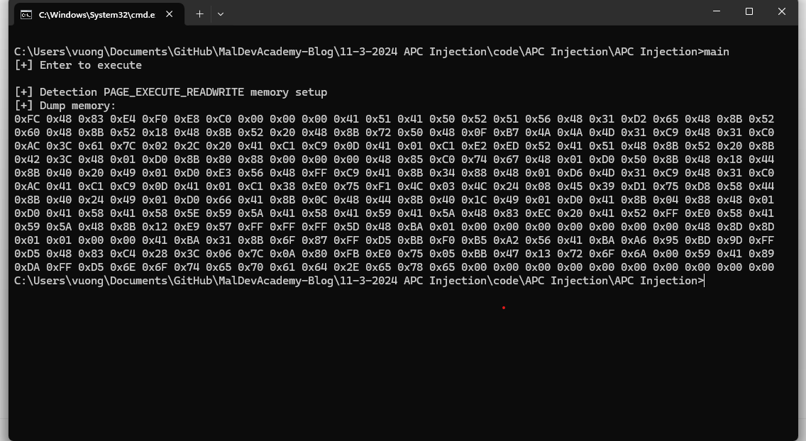

## API Hooking

API Hooking is the redirection of an original API to another function for execution. This is achieved by reading and modifying the code of an API, redirecting it to the code that needs to be executed, and fixing it afterwards. API Hooking is commonly used in analysis and debugging, detecting malware, however, in malware development it also has some functions such as:

- Collecting sensitive information (example: Credentials)
- Modifying or blocking function calls for malicious purposes
- Bypassing security measures by changing how the operating system works (AMSI, ETW,...)

### Operating Mechanism

Below is a diagram of how to change the behavior of an API:


After modifying the code of an API, executing our own code, we need to restore the code as before, while being able to call the API in the malicious function, so that the originally called API is executed, avoiding suspicion.
Additionally, the parameters of our custom function must also match the API being called, in order to pass it to the next API call.

The code is simple, so I won't explain it in the article. See more in the source code attached.

### CheckAV

- VS2022 build detected as malware before execution.
- GCC build not detected when running

### Build DLL Detection VirtualProtect Code Malicious

As mentioned before, API Hooking is often used to detect malware. The code below continues to develop the code above, aiming to detect malicious memory called with `VirtualProtectEx` in the `APC Injection` section used.

```c
BOOL MyVirtualProtectEx(
    HANDLE hProcess,
    LPVOID lpAddress,
    SIZE_T dwSize,
    DWORD  flNewProtect,
    PDWORD lpflOldProtect
) {
    if (flNewProtect == PAGE_EXECUTE_READWRITE) {
        printf("[+] Detection VirtualProtectEx with PAGE_EXECUTE_READWRITE\n");
        printf("[+] Dump memory:\n");
        BYTE* bBuffer = new BYTE(dwSize);
        if (!ReadProcessMemory(hProcess, lpAddress, bBuffer, dwSize, NULL)) {
            printf("[!] ReadProcessMemory Error with code: %d\n", GetLastError());
            goto end;
        }
        for (int i = 0; i < dwSize; i++) {
            printf("0x%02X ", bBuffer[i]);
        }
        Free(bBuffer);
    }
    end:
    RemoveHook(&Hook);
    return VirtualProtectEx(
        hProcess,
        lpAddress,
        dwSize,
        flNewProtect,
        lpflOldProtect
    );
}

```

***DLL Main***
```c
BOOL APIENTRY DllMain( HMODULE hModule,
                       DWORD  ul_reason_for_call,
                       LPVOID lpReserved
                     )
{
    switch (ul_reason_for_call)
    {
    case DLL_PROCESS_ATTACH: { 
        
        if (!InititalizeHookStruct((PVOID)VirtualProtectEx, (PVOID)MyVirtualProtectEx, &Hook)) {
            printf("[!] InititalizeHookStruct Failed\n");
            break;
        }
        if (!InstallHook(&Hook)) {
            printf("[!] InstallHook Failed\n");
            break;
        }
        break;
    }
       
    case DLL_THREAD_ATTACH:
    case DLL_THREAD_DETACH:
    case DLL_PROCESS_DETACH:
        break;
    }
    return TRUE;
}
```

Using `Process Hacker` to inject the DLL above into `APC Injection`:



And here is the result:



Thus, in malware detection, we can use hooks to check suspicious APIs and observe their behavior to block them.
