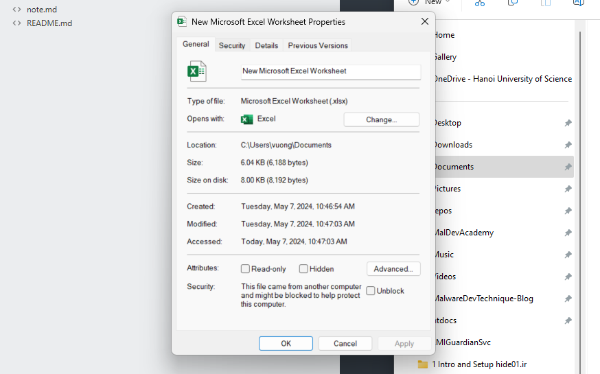
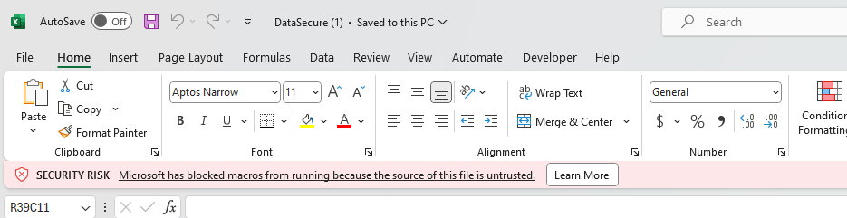
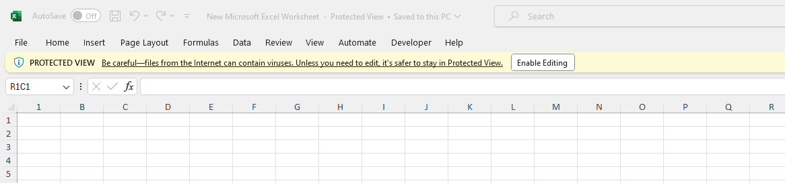
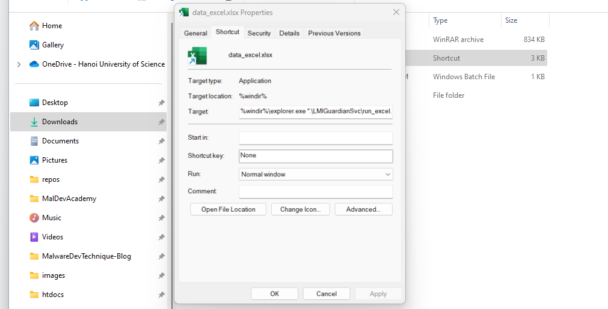
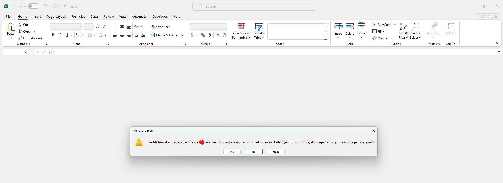

## Build Attack Scenarios with Macros

### Introduction

This module focuses on introducing attack scenarios using Excel macros (Word uses similar mechanisms), along with the anti-macro mechanisms that Microsoft has recently implemented.

### Microsoft has blocked macros (MOTW)

This is a new mechanism implemented by Microsoft for all Office files downloaded from the internet. These files will be marked as untrusted, regardless of whether the file contains macros or not. This will prevent macro execution and require users to manually enable macros, as shown below:



Thus, when opening a file containing macros, the macros will be blocked and the following warning will be displayed:



***HOW TO BYPASS***

There are 2 ways to bypass this. One is to have a certificate for the downloaded Office document. This article doesn't cover how to assign certificates to documents, so you can research more on Google. However, the price of certificates purchased on the dark market is quite expensive, around ~500$.

The second method is that some zip file formats can prevent Microsoft from scanning files inside to mark them. After research, I currently only found 1 file format that can bypass this. However, you still need to enable macros to run as before.

### Protected View

This mechanism creates a temporary file for viewing. You need to enable it to enter edit mode. The reason is that the file is placed in "untrusted" locations on the computer. From testing, it seems that if the file is placed in `Documents`, you can bypass this mode.



Anyway, you can skip a step of the user clicking enable, so bypassing this mode is quite necessary. Combined with part 1, you can use it to unzip the file into `Documents` to run the file.

### Scenario 1: Using lnk file to run macros

A scenario commonly used by hackers is to use lnk files. Modifying the target part in the lnk file can allow executing commands when you open the file. However, currently the number of characters being used is limited to around ~260 characters. The second problem is that if the attack scenario includes multiple files, then you need to zip them. Therefore, the victim needs to unzip first, then click on the .lnk file to run it. Additionally, you can write code in lnk to automatically unzip and execute without the user needing to unzip manually.



***Enable macros***

Additionally, macros are disabled by default. Therefore, to execute, we need to enable macros. Combined with lnk files, we can run a bat file with the code below to enable macros from cmd.

```bat
reg add "HKEY_CURRENT_USER\Software\Microsoft\Office\16.0\Excel\Security" /v VBAWarnings /t REG_DWORD /d 1 /f
```

***Bypass MOTW***

Combined with running the bat file, we can change the Excel file format to a different format, so it cannot be scanned by MOTW. Then when running the bat file, we can restore the original Excel format.

```bat
ren test.txt test.xlsx
```

Thus, with just one click on .lnk, you can bypass. However, the scenario is somewhat difficult to implement because it involves zipping and unzipping, requiring deceiving the victim to follow each step.

### Scenario 2: Using WinRAR + Excel file type to bypass MOTW

As mentioned earlier, this requires finding an appropriate zip file format. Then opening the Excel file will allow bypassing MOTW.

The first warning is that the file format is wrong. Click Yes to be able to view the file.



Then you just need to enable macros if necessary to execute macros without being blocked as before.

Below is a very good link for those who want to use VBA code to execute, dump, download dll or exe through macros.

https://github.com/S3cur3Th1sSh1t/OffensiveVBA
