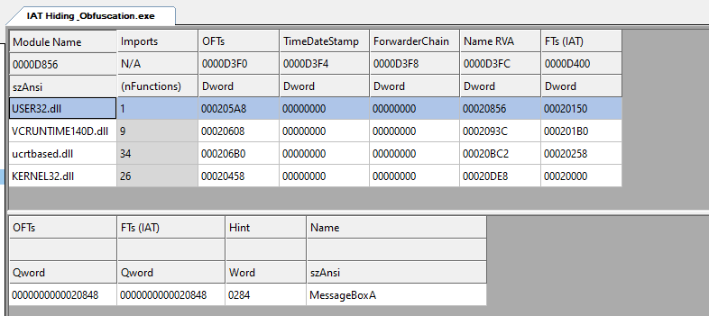
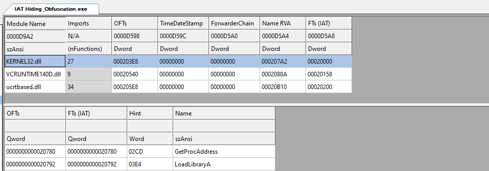
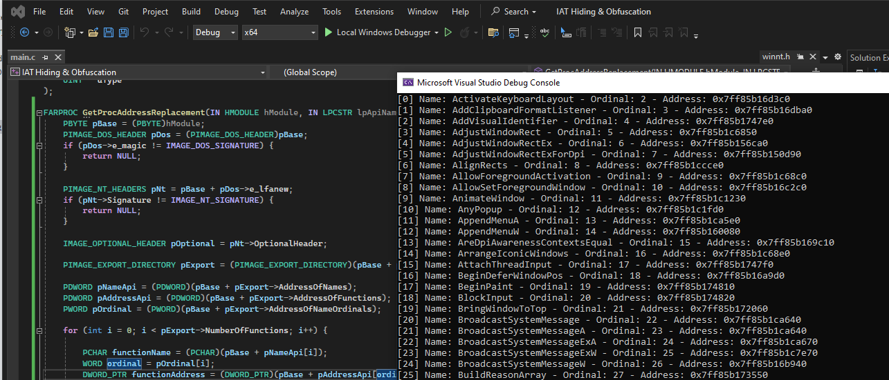

## IAT Hiding & Obfuscation - Custom GetProcAddress

### Table of Contents
1. [Introduction](#introduction)
2. [Hiding API using GetProcAddress](#hiding-api-getproc)
3. [Writing custom GetProcAddress function to retrieve function addresses](#custom-getproc)

### Introduction {#introduction}

IAT (Import Address Table) contains information about library functions dynamically loaded (imported) into the program and the addresses of those functions in memory.
Using APIs in malware can be detected through the IAT if you don't implement hiding and obfuscation techniques. With simple code like `MessageBoxA`,
you can observe the IAT of the executable as follows:

```c
# include <Windows.h>

int main() {
	MessageBoxA(NULL, NULL, NULL, NULL);
	return 1;
}

```



Based on the IAT, you can detect APIs like `GetThreadContext` and `ResumeThread`, thus recognizing that the file may be malicious.

### Hiding API using GetProcAddress {#hiding-api-getproc}

`GetProcAddress` is an API used to get a function address based on the HANDLE of the dll containing that function and the function name. Below is how to get and use MessageBoxA without
leaving information in the IAT.

```c
# include <Windows.h>

typedef int (*WINAPI MessageBoxType) (
	HWND   hWnd,
	LPCSTR lpText,
	LPCSTR lpCaption,
	UINT   uType
);

int main() {
	HMODULE hUser32 = LoadLibraryA("user32.dll");
	MessageBoxType MessageBoxAfn = (MessageBoxType)GetProcAddress(hUser32, "MessageBoxA");
	MessageBoxAfn(NULL, "Hello", "hi", MB_OK);
	return 1;
}
```



Thus, the `User32.dll` library and the `MessageBoxA` API no longer appear in the IAT. Instead, there will be `LoadLibraryA` and `GetProcAddress` from the `Kernel32.dll` library.
However, using `GetProcAddress` also leaves suspicious information. Therefore, in the next section, we will explore alternative functions to `GetProcAddress`.

### Writing custom GetProcAddress function to retrieve function addresses {#custom-getproc}

The `GetProcAddress` function searches in the dll module for the function address with the function name passed as a parameter. Then it traverses the Export Directory Table to get the function address. Detailed information
about the structure can be found here: [PE format](https://learn.microsoft.com/en-us/windows/win32/debug/pe-format#export-directory-table).

***Export Directory***

To access the export directory, we use the code below. However, this requires the `hModule` of the dll containing the API. Therefore, if the dll is already loaded, we only need to use `GetModuleHandle` to get the handle. If not loaded, we will need to use `LoadLibrary` to do this.

```c
FARPROC GetProcAddressReplacement(IN HMODULE hModule, IN LPCSTR lpApiName) {
	PBYTE pBase = (PBYTE)hModule;
	PIMAGE_DOS_HEADER pDos = (PIMAGE_DOS_HEADER)pBase;
	if (pDos->e_magic != IMAGE_DOS_SIGNATURE) {
		return NULL;
	}

	PIMAGE_NT_HEADERS pNt = pBase + pDos->e_lfanew;
	if (pNt->Signature != IMAGE_NT_SIGNATURE) {
		return NULL;
	}

	IMAGE_OPTIONAL_HEADER pOptional = pNt->OptionalHeader;

	PIMAGE_EXPORT_DIRECTORY pExport = (PIMAGE_EXPORT_DIRECTORY)(pBase + pOptional.DataDirectory[IMAGE_DIRECTORY_ENTRY_EXPORT].VirtualAddress);

	///////////////////////////


	return NULL;
}
```

Below is the struct of Export Directory:

```c
typedef struct _IMAGE_EXPORT_DIRECTORY {
    DWORD   Characteristics;
    DWORD   TimeDateStamp;
    WORD    MajorVersion;
    WORD    MinorVersion;
    DWORD   Name;
    DWORD   Base;
    DWORD   NumberOfFunctions;
    DWORD   NumberOfNames;
    DWORD   AddressOfFunctions;     // RVA from base of image
    DWORD   AddressOfNames;         // RVA from base of image
    DWORD   AddressOfNameOrdinals;  // RVA from base of image
} IMAGE_EXPORT_DIRECTORY, *PIMAGE_EXPORT_DIRECTORY;
```

In the above structure, pay attention to 3 important fields: `AddressOfFunctions`, `AddressOfNames`, and `AddressOfNameOrdinals`.
They point to 3 tables respectively: `Export Address Table`, `Export Name Pointer Table`, and `Export Ordinal Table`. See details at the
PE format link provided above. These 3 tables provide information about the address, name, and ordinal of the API.

Code to read the APIs in the dll:

```c
PDWORD pNameApi = (PDWORD)(pBase + pExport->AddressOfNames);
PDWORD pAddressApi = (PDWORD)(pBase + pExport->AddressOfFunctions);
PWORD pOrdinal = (PWORD)(pBase + pExport->AddressOfNameOrdinals);

for (int i = 0; i < pExport->NumberOfFunctions; i++) {

	PCHAR functionName = (PCHAR)(pBase + pNameApi[i]);
	WORD ordinal = pOrdinal[i];
	DWORD_PTR functionAddress = (DWORD_PTR)(pBase + pAddressApi[ordinal]);

	printf("[%d] Name: %s - Ordinal: %d - Address: 0x%I64x\n", i, functionName, ordinal, functionAddress);
	
}
```

Here is the result:



So we only need to pass the API name parameter to find the address in the loaded dll.
