## Malware Compiling

Code used:
```c
#include <Windows.h>

int main() {
	MessageBoxA(NULL, "Hi", "Hi", MB_OK);
	return 1;
}
```

### Building with VS2022

***Release MD***
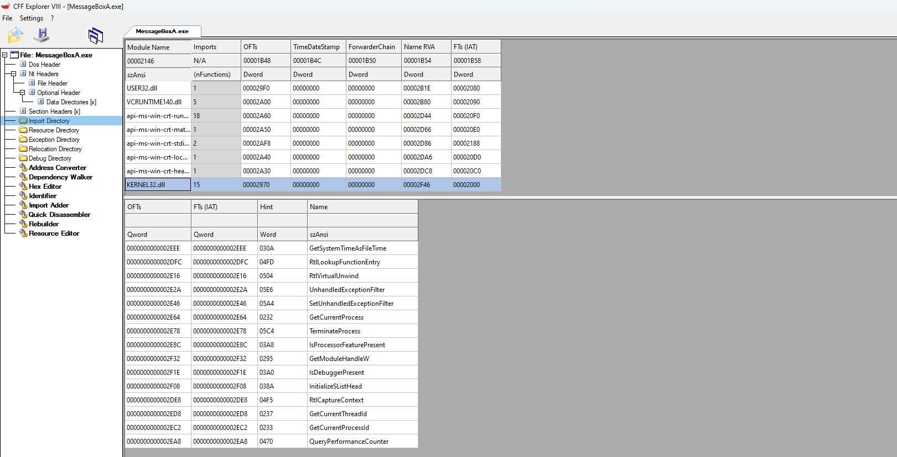

***Release MT***
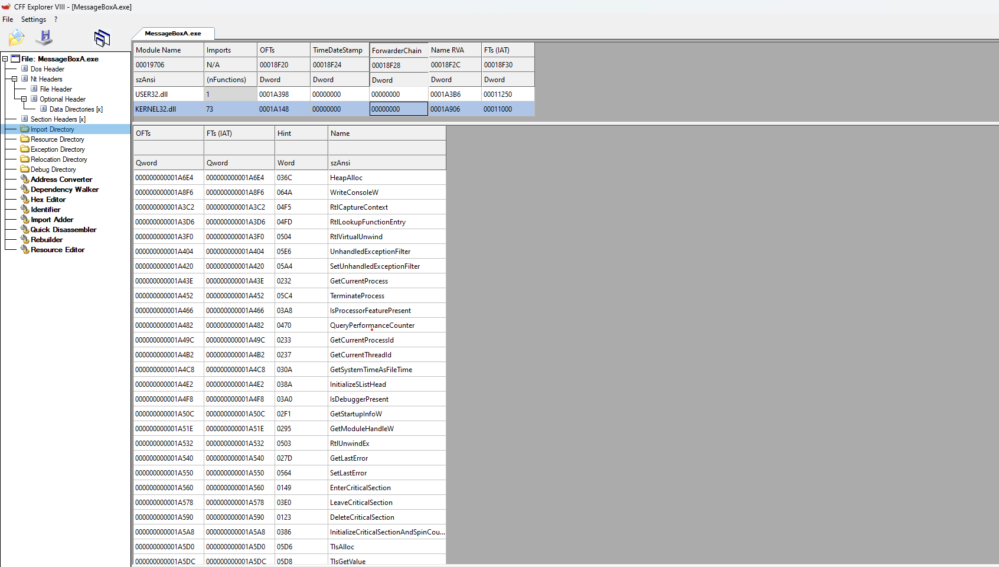

***Disable Debug information + C++ Exception + Optimization + Manifest***

Does not affect IAT, only removes information and optimizes code.

Disable `Generate Debug Info`:

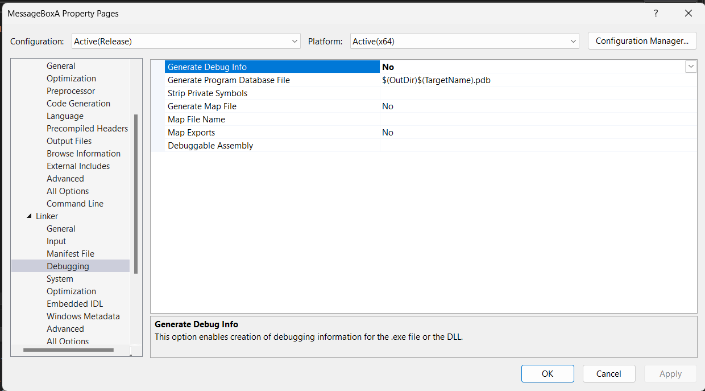

Disable `Enable C++ Exception`:

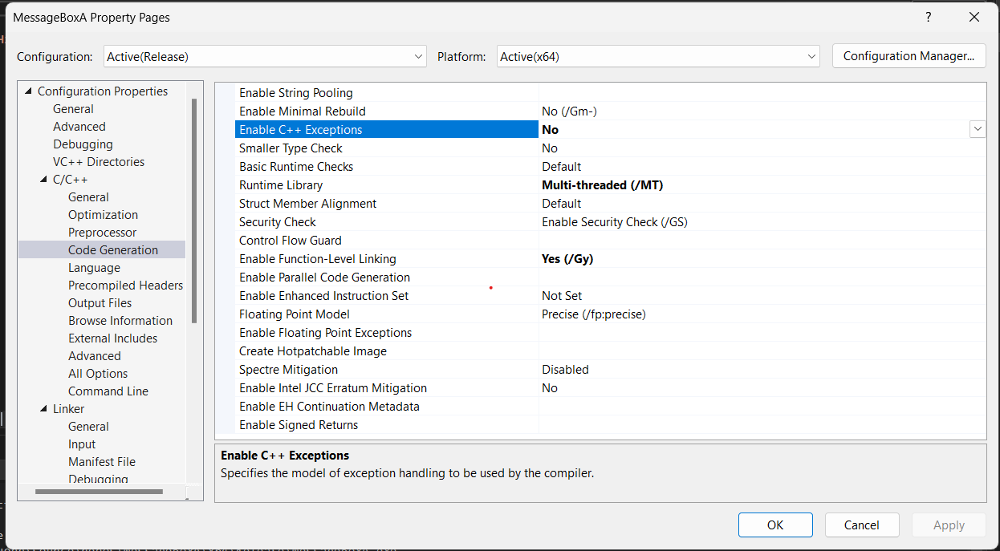

Disable `Whole Program Optimization`:

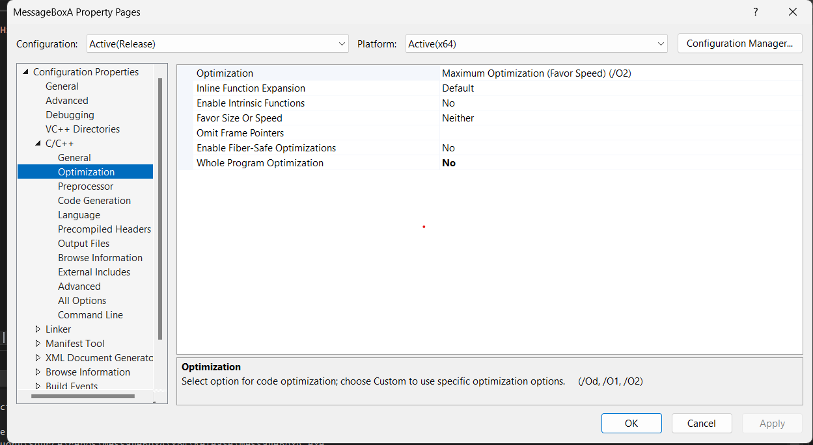

Disable `Generate Manifest`:

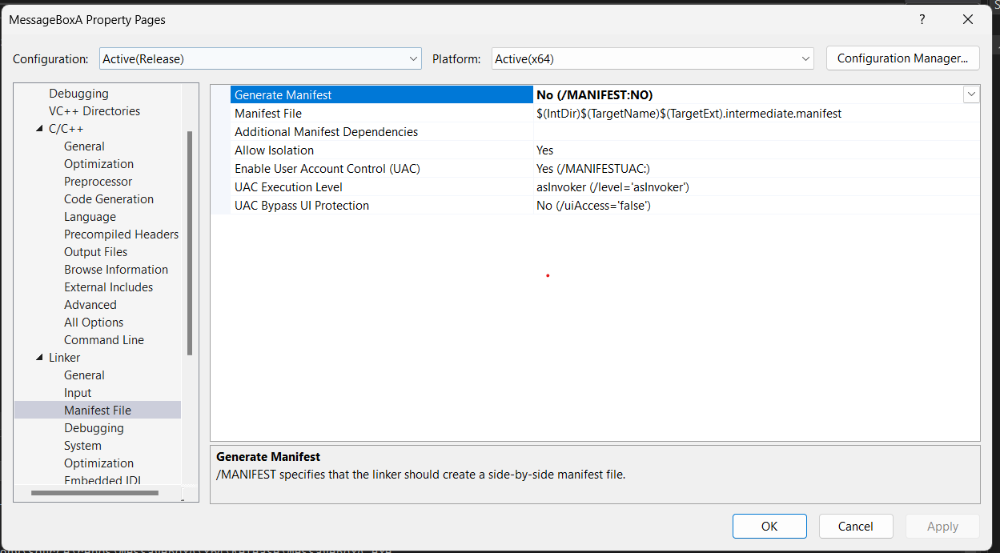

Disable `Windows Console`:

Use the `ShowWindow(NULL, SW_HIDE)` API, also convert the application to /SUBSYSTEM:WINDOWS

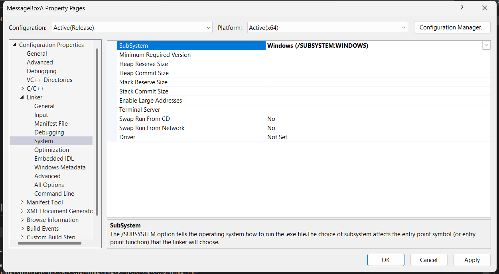

***Nodefaultlibs***

Enabling this option causes the following error:

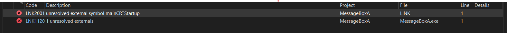

Change the entryPoint to main to fix the above error.

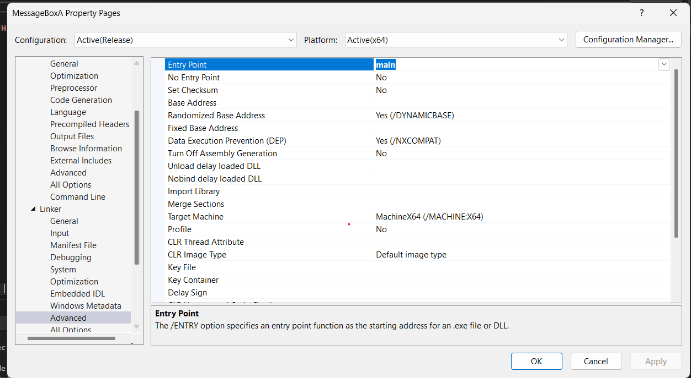

Result: file size reduced from 113kb to 3kb:

Initially when building release MT + no debug:

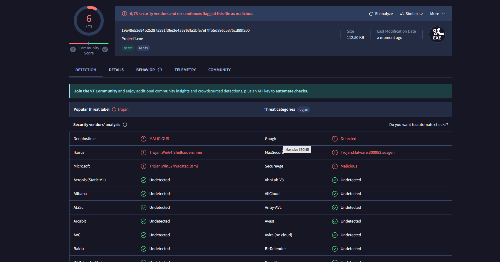

After optimizing everything:

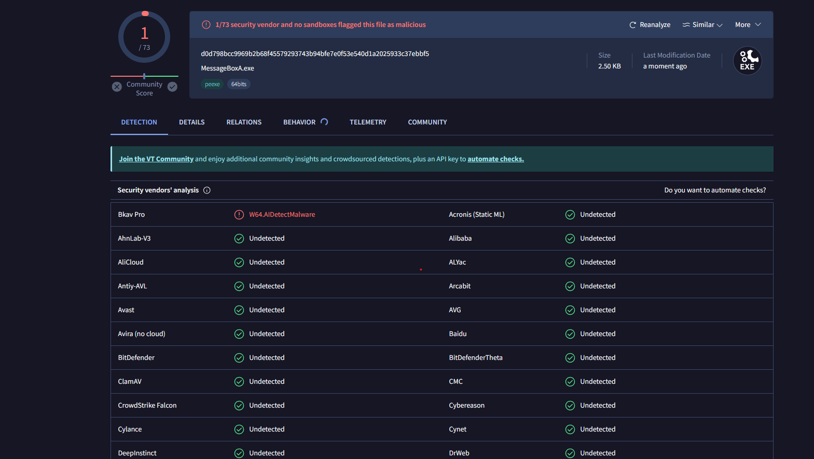

### Building code with gcc/g++

Using gcc/g++ encounters more issues, however, the effectiveness is equal to or better than building with vs2022. However, the file size after building is somewhat larger. GCC/G++ download link: https://winlibs.com/

```cmd
g++ -fno-exceptions -O0 main.cpp -o main -nostdlib -luser32 -lgcc -lmsvcr120 -mwindows
```

- `-fno-exceptions`: Disable exceptions similar to vs2022 above
- `-O0`: disable code optimization
- `-nostdlib`: fully control the linking process, remove startup files. Using this parameter will remove `CRT`, however, need to link libraries that will be used. Also, the program will not use main as entry point
- `-luser32`: Link Windows library if using dll in the program
- `-lgcc`: Help the program recognize `main` as entry
- `-lmsvcr120`: Fix error `atexit()` not found
- `-mwindows`: Hide console when the program runs

Additionally, there are some important parameters to note if needed:

- `-lmsvcrt`: link crt library
- `-s`: Optimize code to be shorter, reduce number of sections (Reduced from 19kb to 5kb but +1 virustotal)
- `-flto`: Optimize code (reduce size and code still runs well: from 19kb to 15kb).
- `-DNDEBUG`: Remove debug symbols

***Note***

It seems using `-lmsvcr120` can fix the error, however, for copyright reasons, gcc mingw is not allowed to statically link. This causes the file to run on machines without `mscvr120.dll` to cause errors. Currently, no fix has been found for this error (or atexit() error).

***VirusTotal result***

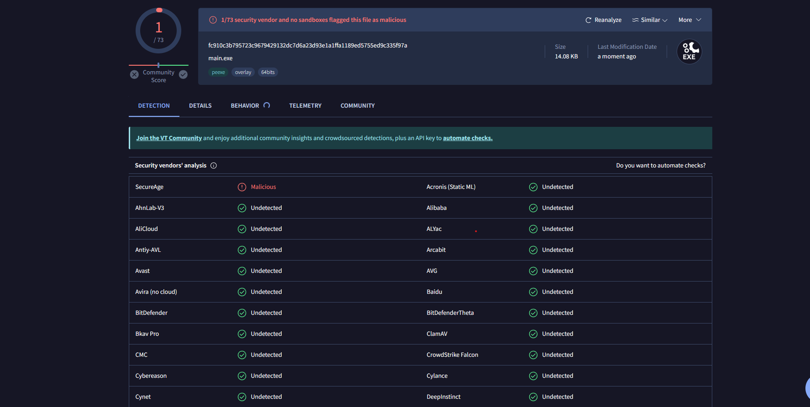
