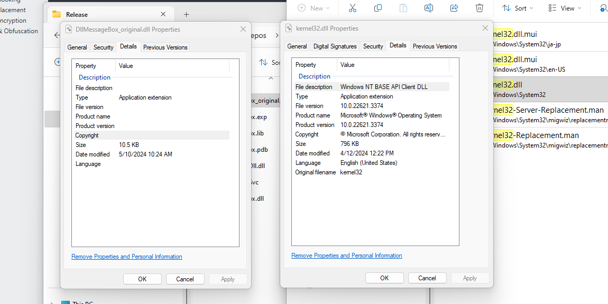
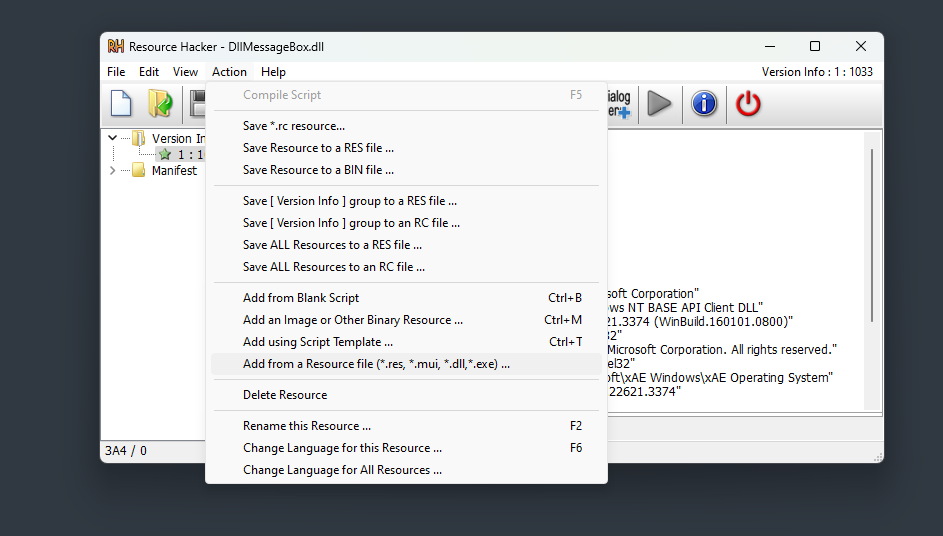
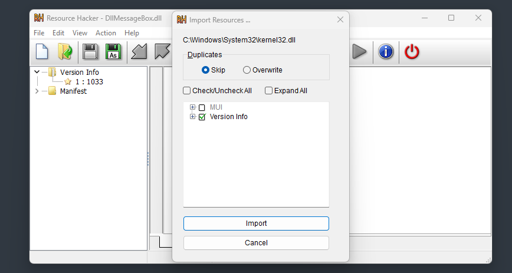
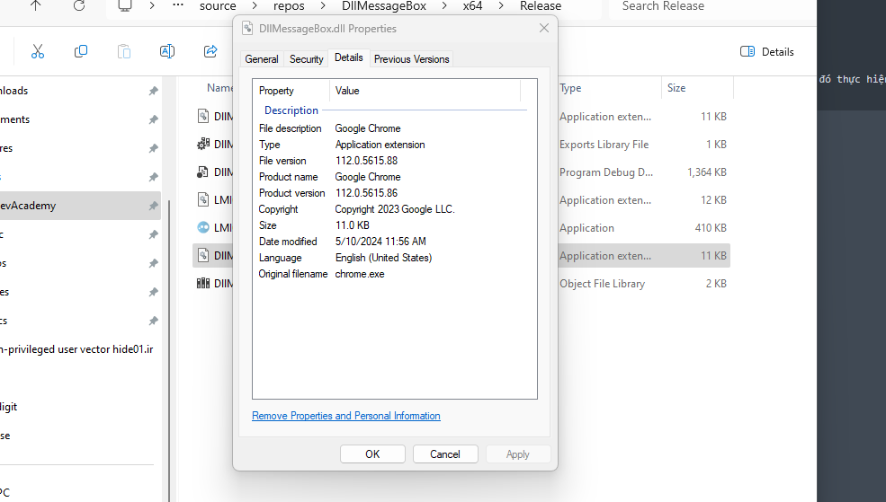
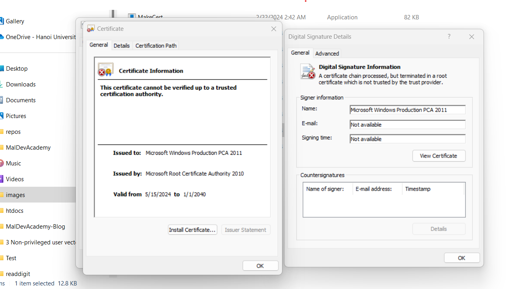

## Module Details and Binary Signature Modify

### Module Details

To understand simply, let's look at the 2 files `DllMessageBox.dll` and `kernel32.dll` below:



The details section of `kernel32.dll` will naturally contain more credible information compared to `DllMessageBox.dll`. This section will guide installing this information into our dll and exe files.

***Method 1: Resource Hacker***

First open the file that needs to be modified with `Resource Hacker`, select **Action => Add from Resource file**



Find the file that needs to get details. Here it is `kernel32.dll`, tick `VersionInfo` and add it. Save the file and it will have the information needed:



***Method 2: Add resource VS2022***

Open dll, exe with VS2022 (or other versions), then add resource (In the resource file section). Here the file is named `metadata.rc`. Then proceed to edit the file content as follows:

```rc
1 VERSIONINFO
FILEVERSION 112, 0, 5615, 88 // File version separated by commas
PRODUCTVERSION 1, 0, 0, 0
FILEFLAGSMASK 0x0L
#ifdef _DEBUG
FILEFLAGS 0x1L
#else
FILEFLAGS 0x0L
#endif
FILEOS 0x0L
FILETYPE 0x0L
FILESUBTYPE 0x0L
BEGIN
BLOCK "StringFileInfo"
BEGIN
BLOCK "040904B0"
BEGIN
// Modify the values below
VALUE "CompanyName", "Google LLC."
VALUE "FileDescription", "Google Chrome"
VALUE "InternalName", "Chrome"
VALUE "LegalCopyright", "Copyright 2023 Google LLC."
VALUE "OriginalFilename", "chrome.exe"
VALUE "ProductName", "Google Chrome"
VALUE "ProductVersion", "112.0.5615.86"
END
END
BLOCK "VarFileInfo"
BEGIN
VALUE "Translation", 0x409, 1200
END
END
```

Build the file and the result is as follows:



### Binary Signature Modify

This section will guide creating fake signatures, mainly used to increase user trust. The signature is not actually signed, so it will not have the effect of bypassing AV. Tools that can be used can be found in the tools folder uploaded with this post, or at `C:\Program Files (x86)\Windows Kits\...`

Below are commands to use to create a signature on `DllMessageBox.dll`:

```bat
MakeCert.exe -r -pe -n "CN = Microsoft Root Certificate Authority 2010,O = Microsoft Corporation,L = Redmond,S = Washington,C = US" -ss CA -sr CurrentUser -a sha256 -cy authority -sky signature -sv CA.pvk CA.cer


MakeCert.exe -pe -n "CN=Microsoft Windows Production PCA 2011,O = Microsoft Corporation,L = Redmond,S = Washington,C = US" -a sha256 -cy end -sky signature -eku 1.3.6.1.5.5.7.3.3,1.3.6.1.4.1.311.10.3.24,1.3.6.1.4.1.311.10.3.6 -ic CA.cer -iv CA.pvk -sv SPC.pvk SPC.cer

pvk2pfx -pvk SPC.pvk -spc SPC.cer -pfx SPC.pfx

sigtool.exe sign /v /f SPC.pfx DllMessageBox.dll
```

And here is the result:


