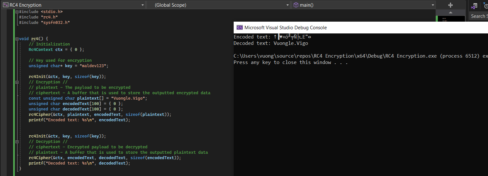
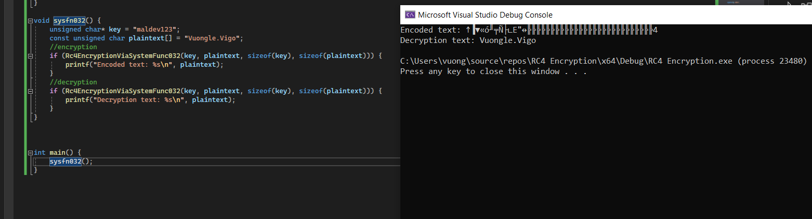

## Payload Encryption

### RC4 Algorithm

RC4 is a stream cipher algorithm that processes data byte-by-byte. Created by Ron Rivest in 1987, RC4 is widely used in security applications such as wireless networks and SSL/TLS for HTTPS protocol.

The RC4 mechanism is straightforward, using a key to generate a state table (S-table) of 256 bytes. During encryption, RC4 generates a pseudo-random byte sequence from the S-table and XORs it with the data to be encrypted.

This section does not explain how RC4 encryption works in detail—all implementation is provided in the accompanying code. The code includes two implementation approaches: one is a custom implementation (based on MalDevAcademy's reference), and the other uses two NTAPIs: **SystemFunc032** and **SystemFunc033**. Since these two functions accept the same parameters, only **SystemFunc032** is implemented in the code. To use **SystemFunc033**, simply use **GetProcAddress** to resolve it.

Below is the encryption result when using the custom implementation:

And here is the result when using **SystemFunc032** or **SystemFunc033**:

It appears that the encryption result using **SystemFunc032** has some padding added.

Encryption will be used to encrypt payloads in subsequent sections. The code is included with this article.

### AES CBC - WinAPI

AES is a block cipher algorithm that operates on fixed-size data blocks. Each block is 128 bits (16 bytes). Therefore, input data must be a multiple of 16 bytes. If the data is not a multiple, padding must be added before encryption. AES supports three main key sizes: 128-bit, 192-bit, and 256-bit, referred to as AES-128, AES-192, and AES-256 respectively.

This section uses WinAPI to implement encryption. The implementation details and code examples are included in the accompanying materials for practical reference and implementation guidance.

The payload encryption techniques described here serve as the foundation for subsequent chapters on payload obfuscation and delivery mechanisms. Understanding these encryption methods is crucial for developing effective malware evasion strategies while maintaining operational security.
