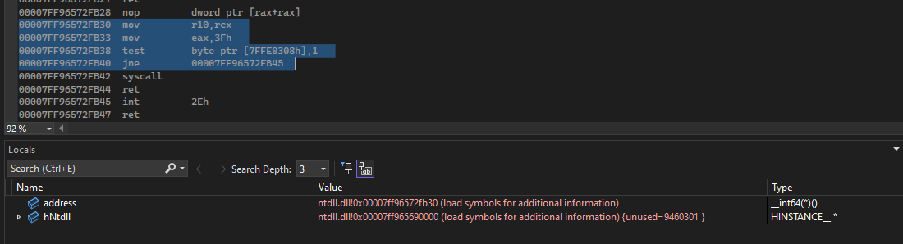

## Syscalls

In the previous article, we discussed [API Hooking](https://github.com/vuongle-vigo/MalDevAcademy-Blog/tree/main/14-3-2024%20API%20Hooking), which can be used to detect payloads with permissions granted by `VirtualProtectEx` at the end of the article. I also have an article about bypassing this hooking technique using [Direct Syscall](https://github.com/vuongle-vigo/WinMalHack-Blog/tree/main/Process%20Injection/Bypass%20AV%20Hook%20-%20Direct%20Syscall).

### Building syscall assembly code with gcc/g++

In the article [Direct Syscall](https://github.com/vuongle-vigo/WinMalHack-Blog/tree/main/Process%20Injection/Bypass%20AV%20Hook%20-%20Direct%20Syscall), using vs2022/masm to build syscall code was mentioned. However, as in previous articles, code built with vs2022 is easily detected by AV. Therefore, this article will guide building syscall code with gcc/g++.

The difference between these 2 compilers is that gcc/g++ uses GAS syntax instead of MASM. Therefore, the assembly code needs to be written slightly differently.

***MASM***
```asm
.code
SysNtReadVirtualMemory proc
    mov     r10, rcx
    mov     eax, 3Fh
    syscall
    ret
SysNtReadVirtualMemory endp
end
```

***GAS***
```s
.global SysNtReadVirtualMemory

SysNtReadVirtualMemory:
    mov     %rcx, %r10
    mov     $0x3F, %eax
    syscall
    ret
```

Declare `global` to be able to use from outside, use % before registers, $ before immediates and `source, dest` syntax. GAS code needs to be saved in .s file.

***Compile***

First, convert .s file to .o object file:

```
gcc -c syscall.s -o syscall.o
```

Then compile with the accompanying .c/.cpp file:

```
gcc main.c syscall.o -o main.exe
```

By building code using the method above, we can see that many repeated assembly code sections will appear in the code, leading to AV detection. This was proven in the [Bypass AV](https://github.com/vuongle-vigo/MalDevAcademy-Blog/tree/main/20-3-2024%20Bypass%20AV) article.

The solution proposed is to use only a single syscall assembly code with an undetermined NTAPI code (SSN). We will calculate the NTAPI code we need to call to find the SSN, then replace it in assembly and execute the call as before.

### Finding the SSN of NTAPI

As known before, to get the execution address of an NT function, the simplest way is to use GetProcAddress.

```c
# include <Windows.h>

int main() {
    HMODULE hNtdll = LoadLibraryA("ntdll.dll");
    FARPROC address = GetProcAddress(hNtdll, "NtReadVirtualMemory");

    return 1;
}
```

Debug + Disassembly to view the code at the `address` returned from `GetProcAddress` above, we get the following result:



So we can see that the address returned from `GetProcAddress` is indeed the NTAPI code. To get the SSN, just add 4 bytes and read the value there.

```c
BYTE* SSNptr = (BYTE*)address + 4;
DWORD SSN = *SSNptr;
```

This is the SSN value we obtain. Next, how to use this SSN for the syscall instruction.

Use 2 assembly functions to perform this. The first function is used to store the SSN value passed into ecx, store it in a global variable. The second function will then use this variable as the SSN value, execute the syscall.

The code uses a combination of Customer GetProcAddress, GetModuleHandle, and API Hashing which is attached.

### Idea of building indirect syscall

With a similar technique as above, it is entirely possible to implement indirect syscall. We will need an additional global variable to store the address of a syscall from any function, then replace the syscall instruction in the original code with a jmp instruction to this address. Additionally, using instructions like `mov r10, rcx` or `mov eax, SSN` will cause it to have a signature (I usually use this to find SSN), helping AV find it. Therefore, we can combine other harmless calculation instructions, obfuscate the assembly code to increase the ability to evade AV.
